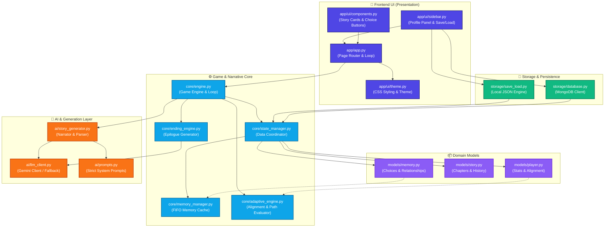

# 🧠 Adaptive AI Story Engine

[](https://github.com/topics/generative-ai)
[](https://github.com/topics/interactive-fiction)
[](https://github.com/topics/streamlit)
[](https://github.com/topics/gemini-api)
[](https://github.com/topics/game-engine)
[](https://www.python.org/)
[](https://opensource.org/licenses/MIT)

An advanced, highly responsive interactive fiction framework built with **Python**, **Streamlit**, and **Google Gemini/Gemma LLMs**. 

The **Adaptive AI Story Engine** dynamically weaves unique narratives, structures character-driven choices, and shifts the entire fictional environment's tone based on the player's moral decisions. With a robust local and cloud persistence layout, self-healing JSON parsing, and a fault-tolerant AI client, it represents a state-of-the-art implementation of LLM-driven gameplay.

---

## 🏷️ GitHub Repository Tags
`generative-ai` `interactive-fiction` `streamlit` `gemini-api` `gemma-llm` `game-engine` `python` `rpg` `adaptive-narrative` `state-machine` `ai-storyteller` `mongodb`

---

## 🌟 Key Features

1. **🎭 Real-Time Moral Alignment & Trajectory Analysis**
   Every action shifts the player's alignment (clamped from `-100` to `+100`). The engine analyzes these scores to place players on **Heroic**, **Neutral**, or **Villainous** paths.

2. **🌊 Adaptive Environmental Tone Modification**
   Narrative atmospheres adjust dynamically. If the player acts villainously, the engine injects subtle directives, causing NPCs to treat the player with hostility and fear, while the world adopts darker tones.

3. **🧠 Token-Safe Conversational FIFO Memory**
   A dedicated memory controller tracks previous choices, relationship scores with NPCs, and key plot points. It implements a strict First-In-First-Out (FIFO) cache to keep the context window highly optimized and cost-effective.

4. **⚡ Dual-Layer Persistence System**
   * **Local JSON**: Instantly serializes the entire game state (Player, StoryState, and Memory) to files for simple local debugging.
   * **Scalable NoSQL Database**: Features a pre-configured MongoDB wrapper (ready for Phase 3/4 deployment) utilizing `upsert` transactions to preserve game states across distributed servers.

5. **🛡️ Resilient AI Pipeline & Auto-Fallback**
   Communicates with Gemini using a custom client equipped with exponential backoff retries. If the primary generative model encounters transient issues, the system automatically hot-swaps to a highly stable fallback model (`gemini-2.5-flash`), guaranteeing uninterrupted gameplay.

6. **🛠️ Self-Healing JSON Parser**
   Cleanses raw model outputs by stripping markdown markers, scanning brackets, and matching brace indices from right to left to isolate and extract valid JSON payloads, protecting the engine against hallucinations.

---

## 🏗️ System Architecture

The Adaptive AI Story Engine utilizes a decoupled, layered architecture separating the **Presentation Layer (Streamlit UI)**, **Core Business Logic (Game & Memory Engines)**, **Data Modeling**, **AI Services**, and **Persistence Services**.



### Flow of Execution:
1. **Input**: The player makes a selection on the Streamlit UI (`app/app.py`).
2. **Turn Advancement**: The UI passes the choice to the `GameEngine` (`core/engine.py`).
3. **Tone Injection**: The `GameEngine` queries the `AdaptiveEngine` to fetch a customized prompt modifier reflecting the player's moral alignment.
4. **AI Generation**: The `StoryGenerator` compiles strict system templates from `Prompts`, pulls history from `MemoryManager`, and sends the query to the `LLMClient`.
5. **Robust Parsing**: If the LLM generates cluttered text, the generator filters and parses the payload back into structured fields.
6. **State Update**: The `StateManager` consumes the JSON payload, shifts character alignment values, logs key chapter outcomes, and increments the progress index.
7. **Endings**: When the narrative hits the chapter ceiling (default: `5`), the `EndingEngine` synthesizes the entire memory history to generate a bespoke 3-paragraph epilogue.

---

## 📁 Repository Structure

```text
Adaptive AI Story Engine/
│
├── ai/
│   ├── __init__.py
│   ├── llm_client.py       # Configures Gemini SDK, manages retries and Flash fallbacks.
│   ├── prompts.py          # Structured templates enforcing JSON-response envelopes.
│   └── story_generator.py  # Coordinates generation prompts and houses self-healing JSON parsers.
│
├── app/
│   ├── __init__.py
│   ├── app.py              # Main stream coordinator initializing configurations and views.
│   └── ui/
│       ├── components.py   # Renders the interactive story deck, timeline scroll, and action buttons.
│       ├── sidebar.py      # Controls character profile badges, visual moral progress, and load/save menus.
│       └── theme.py        # Injects specialized custom CSS overrides and core app layouts.
│
├── config/
│   ├── constants.py        # Pre-configures supported genres, UI static headers, and threshold ranges.
│   └── settings.py         # Consolidates API key checkouts, directory setups, and LLM temperature configurations.
│
├── core/
│   ├── __init__.py
│   ├── adaptive_engine.py  # Evaluates moral scores to determine system prompts and path endings.
│   ├── ending_engine.py    # Assembles summaries of game decisions to compose customized epilogues.
│   ├── engine.py           # Runs central game loops, chapter controls, and UI state adapters.
│   ├── memory_manager.py   # Trims stored records in FIFO lists to preserve token boundaries.
│   └── state_manager.py    # Reconstructs, syncs, and packages player, narrative, and memory models.
│
├── data/                   # Initialized upon startup to house local cache directories.
│   ├── saves/              # Hosts serialization `.json` documents.
│   └── logs/               # Holds transaction and API interaction files.
│
├── models/
│   ├── __init__.py
│   ├── memory.py           # Dataclass model mapping relationships, major events, and selections.
│   ├── player.py           # Dataclass model representing name, traits, alignment, and moral scores.
│   └── story.py            # Dataclass model housing current beats, chapter numbers, and path history.
│
├── storage/
│   ├── __init__.py
│   ├── database.py         # Advanced NoSQL Mongo connection manager utilizing upsert transactions.
│   └── save_load.py        # Direct file I/O operations serializing/loading Python state schemas.
│
├── utils/
│   ├── __init__.py
│   ├── logger.py           # Creates standardized application-level transaction logs.
│   └── validators.py       # Sanitizes and truncates names and custom genres to thwart prompt injections.
│
├── .env.example            # Environment skeleton for secure API deployments.
└── requirements.txt        # Houses core python packaging dependencies.
```

---

## 🛠️ Getting Started

### 📋 Prerequisites
* **Python**: `3.8` or newer.
* **Gemini API Key**: Obtain one from [Google AI Studio](https://aistudio.google.com/).

### 💻 Installation & Setup

1. **Clone the Repository**
   ```bash
   git clone https://github.com/your-username/adaptive-ai-story-engine.git
   cd adaptive-ai-story-engine
   ```

2. **Initialize a Virtual Environment**
   ```bash
   # On Windows
   python -m venv .venv
   .venv\Scripts\activate

   # On macOS/Linux
   python3 -m venv .venv
   source .venv/bin/activate
   ```

3. **Install Dependencies**
   ```bash
   pip install -r requirements.txt
   ```

4. **Configure Environment Variables**
   Create a `.env` file in the root directory:
   ```env
   GEMINI_API_KEY=your_gemini_api_key_here
   MONGO_URI=mongodb://localhost:27017/  # Optional: For Phase 3/4 Database Saves
   ```

5. **Launch the Engine**
   ```bash
   streamlit run app/app.py
   ```
   *Your browser should automatically launch and load the application at `http://localhost:8501/`*

---

## 🕹️ How to Play & Features Walkthrough

### 1. Character Initiation
When starting a new adventure:
* Set your unique **Character Name** (Sanitized to a maximum of 20 characters).
* Select a starting realm from established genres (**High Fantasy, Cyberpunk, Cosmic Horror, Noir, Post-Apocalyptic**) or define a **Custom Genre** (e.g., *Cyberpunk Pirate*, *Steampunk Atlantis*).

### 2. Turn Mechanics
* Read the AI-generated scenario in the styled **Story Card**.
* Make a choice from the three dynamic actions presented.
* Expand **"The Story So Far..."** block to read your previous choices and scene history chronological records.

### 3. Moral Drift & UI Badges
* Check the **Player Profile** sidebar panel to monitor your moral index.
* The progress bar adjusts left-to-right (Evil to Good). Your status updates in real-time as **Heroic, Neutral, or Villainous**.

### 4. Epilogue Sequences
* Once you reach **Chapter 5**, the gameplay loop concludes.
* The `EndingEngine` summarizes your major past deeds and generates a bespoke **3-paragraph Epilogue Card** illustrating the long-term impact of your behavior.

### 5. Saving and Loading Game States
* Hit the **"Save Current Game"** button to export your player status, memory history, and active chapter values to a localized `.json` document under `data/saves/`.
* Reload your save file at any time using the interactive dropdown in the sidebar.

---

## 🔒 Security & Sanitization
The system incorporates security modules specifically optimized for LLM safety:
* **Length Caps**: Custom names and genres are strictly sliced (names capped at 20 characters, custom genres at 50) to prevent prompt bloat.
* **Character Striping**: Carriage returns (`\n` / `\r`) are automatically stripped from name variables to prevent structural prompt injection attacks.

---

## 📄 License
This project is licensed under the MIT License - see the [LICENSE](LICENSE) file for details.

---

## 🤝 Contributing
Contributions are highly welcome! Feel free to fork the repository, open an issue to discuss design tweaks, or submit a Pull Request.

*Created with 🧠 by Antigravity (Google DeepMind Advanced Agentic Coding Team).*
